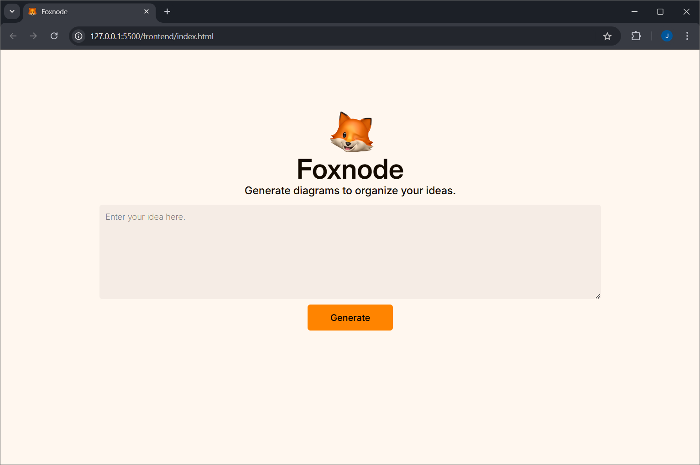
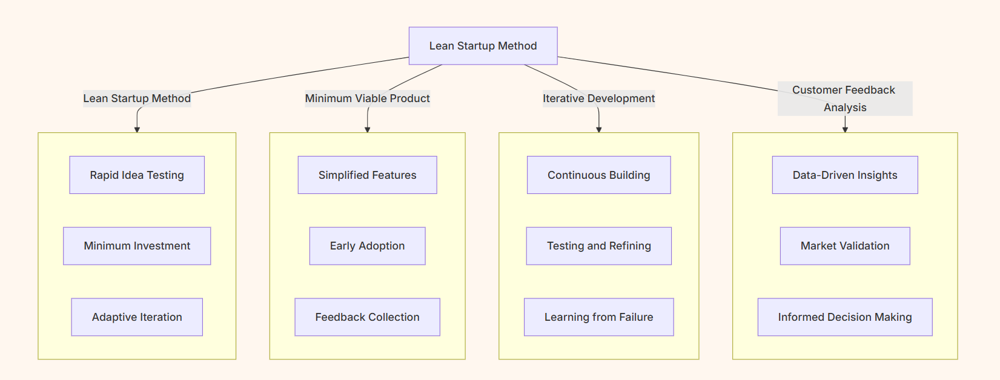

# Foxnode 🦊

**Foxnode** is a web-based application designed to transform user prompts into custom Mermaid diagrams quickly and easily. By leveraging the power of local **Large Language Models (LLMs)** through **Ollama** and **LangChain**, Foxnode offers a private, efficient, and interactive solution for generating flowcharts, sequence diagrams, and more. This tool is built for developers, analysts, project managers, and anyone needing to visualize concepts in diagram form without sacrificing data privacy by keeping all processing local.

Using the **LLama3.2:3b model**, Foxnode interprets user instructions to produce accurate, understandable diagrams in various formats. Ideal for brainstorming sessions, process documentation, and project planning, Foxnode simplifies the process of visualizing complex ideas.

## Key Features
- **User-Friendly Web Interface**: Launch Foxnode directly in your browser, eliminating the need for additional software or plugins. The interface is intuitive, so users can focus on crafting their prompts and viewing their diagrams.

- **Natural Language to Diagram Generation**: Describe the diagram you need in plain English, and Foxnode translates your prompt into the appropriate Mermaid syntax. Generate flowcharts, sequence diagrams, and more using conversational language.

- **Local Model Inference for Privacy and Speed**: The integration of LLama3.2:3b ensures that all prompts are processed locally on your machine, safeguarding data privacy and reducing latency by bypassing cloud-based processing.

- **Powered by Ollama and LangChain**: By combining Ollama's inference capabilities with LangChain's prompt engineering, Foxnode delivers high-quality, contextually accurate diagrams. This setup also supports customizable prompts, allowing users to refine outputs to meet specific needs.

## How It Works
Foxnode uses a local language model to interpret natural language prompts. Once you enter your prompt, the system processes it with the LLama3.2:3b model. The result is a Mermaid-compatible script that automatically renders as a visual diagram within the application.

### Demo

Sample prompt:

`The Lean Startup method is an approach to developing new businesses and products that focuses on rapidly building and testing ideas with real customers to learn and adapt quickly. Rather than investing heavily in a fully-formed product, startups create a "minimum viable product" (MVP) with just enough features to attract early adopters. By gathering feedback, analyzing what works and what doesn’t, and iterating based on this data, they aim to minimize waste, reduce the risk of failure, and make informed decisions about scaling or pivoting. This cycle of build-measure-learn helps startups efficiently refine their offerings to meet market needs.`

Generated diagrams:

## Getting Started

### Prerequisites

### Installation

