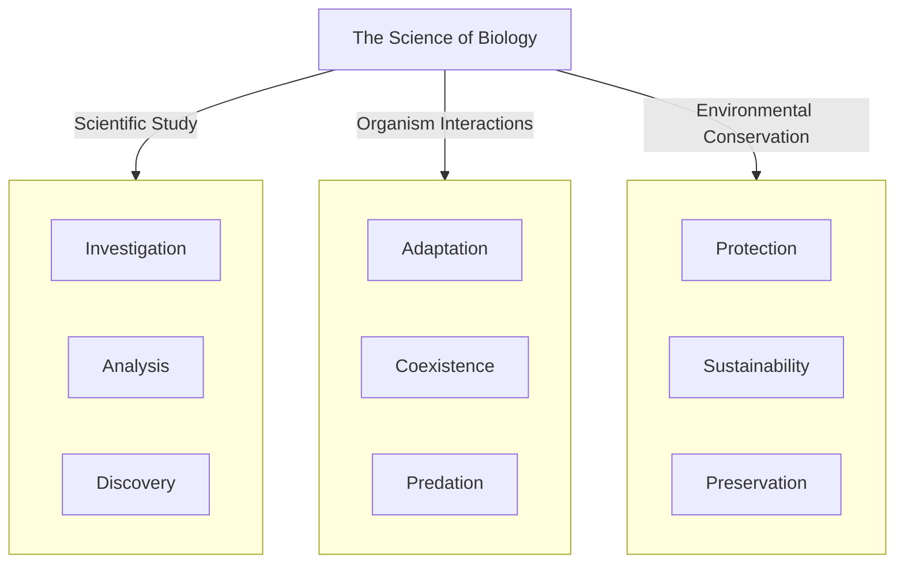

# Biology
Biology is the scientific study of living organisms and their interactions with each other and their environment. It encompasses a wide range of topics, including genetics, evolution, ecology, and physiology, among others. Through the application of scientific principles and methods, biologists investigate the structure, function, growth, development, reproduction, and survival of all living things, from bacteria to humans. The field of biology seeks to understand the complex relationships between organisms and their environment, and to develop new technologies and treatments for human health and environmental conservation.

            