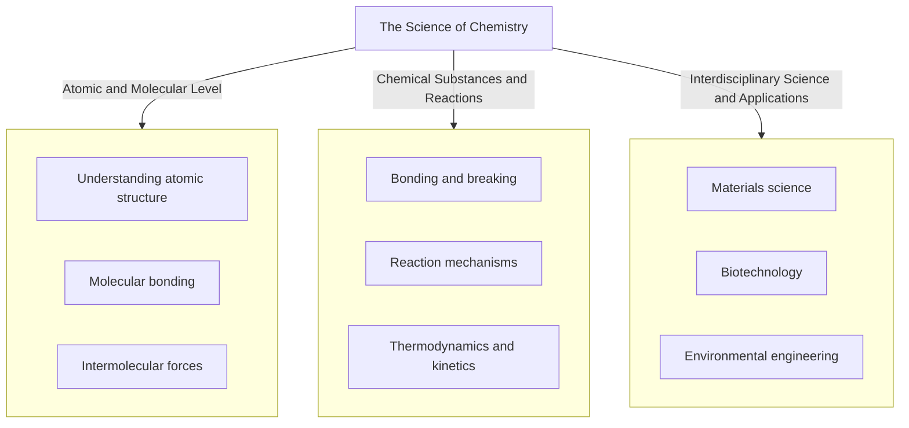

# Chemistry
The field of chemistry is an interdisciplinary science that studies the composition, properties, and reactions of matter at the atomic and molecular level. It involves the application of scientific principles to understand and manipulate the behavior of chemical substances, including their interactions with other elements and compounds. Chemistry encompasses a wide range of topics, from the structure and synthesis of molecules to their physical properties and reactivity. By applying fundamental concepts in physics, mathematics, and biology, chemists aim to develop new materials, products, and processes that can be used in various fields such as medicine, energy, and environmental science.

            