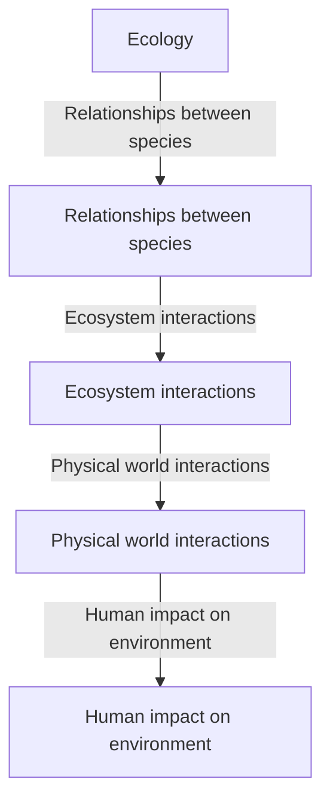

# Ecology
Ecology is the study of how living organisms interact with their environment and affect each other, including the relationships between species, ecosystems, and the physical world around them.

            
            