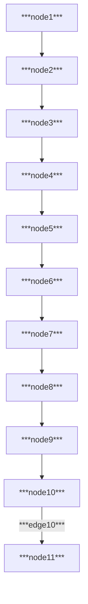

# Oceanography
Oceanography is the scientific study of the ocean and its role in the Earth's ecosystem, including its physical properties, chemical composition, and biological processes. It involves the analysis of ocean currents, tides, waves, and marine life, as well as the impact of human activities on the ocean environment.

            
            