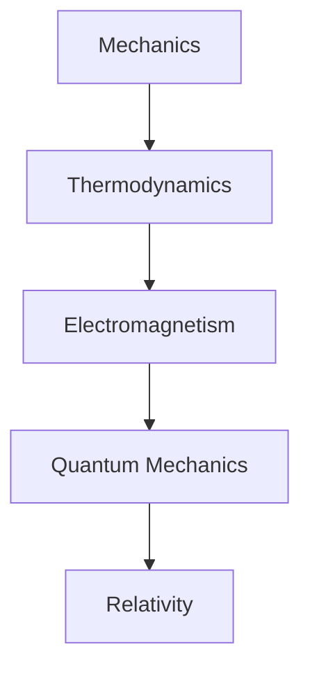

# Physics
The field of physics is the study of the fundamental laws that govern the behavior of energy, matter, and the universe as a whole. It encompasses various branches, including mechanics, thermodynamics, electromagnetism, quantum mechanics, relativity, and cosmology. Physicists use mathematical models and computational simulations to describe and predict the behavior of physical systems, from the smallest subatomic particles to the vast expanses of the cosmos. The pursuit of understanding the underlying principles of reality is a fundamental aspect of physics, driving innovation and advancing our knowledge of the universe.

            
            