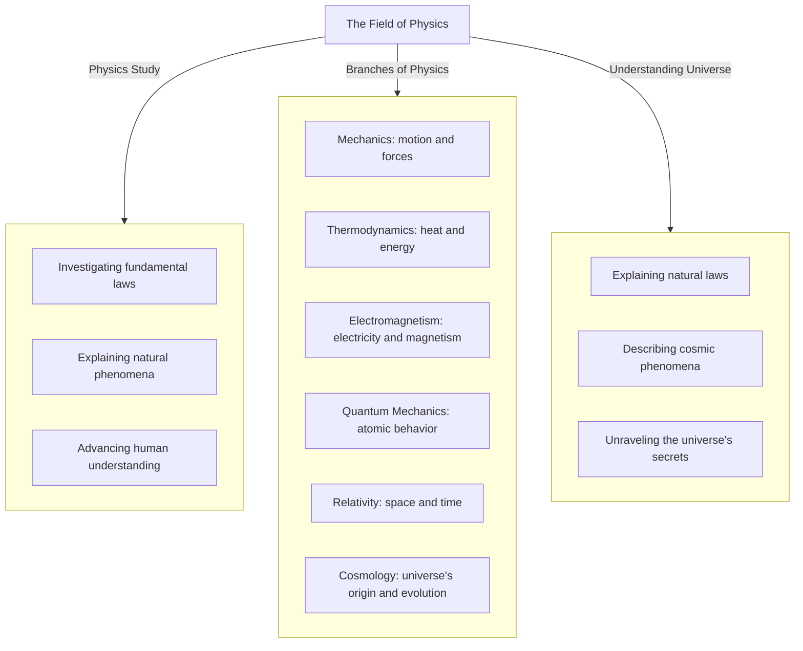

# Physics
The field of physics is the study of the fundamental laws that govern the behavior of energy, matter, and the universe as a whole. It encompasses various branches, including mechanics, thermodynamics, electromagnetism, quantum mechanics, relativity, and cosmology. Physicists use mathematical models and experiments to understand the natural world, from the smallest subatomic particles to the vast expanse of the cosmos. The pursuit of knowledge in physics is driven by a desire to explain the underlying mechanisms that shape our universe and to push the boundaries of human understanding.

            