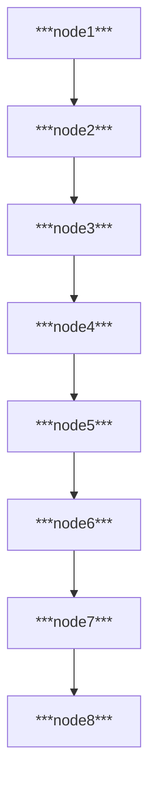

# Astronomy
Astronomy is the scientific study of celestial objects and phenomena, including stars, galaxies, planets, asteroids, comets, and other objects in our universe. It involves the observation, measurement, and interpretation of data from a variety of sources, such as telescopes, spacecraft, and satellites. Astronomers use mathematical and computational techniques to analyze this data and draw conclusions about the properties and behaviors of these celestial objects. The field of astronomy encompasses a wide range of topics, including planetary science, stellar astronomy, cosmology, and astrobiology, among others.

            
            