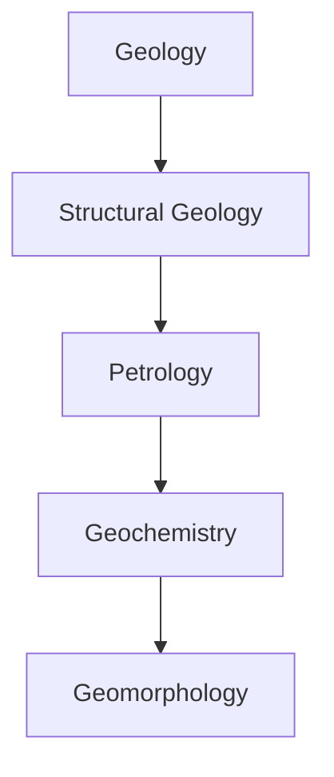

# Geology
Geology is the scientific study of the Earth's physical structure, composition, and processes. It involves the analysis of rocks, minerals, landforms, and natural hazards to understand the Earth's history, evolution, and current state. Geologists examine the Earth's internal and external systems, including plate tectonics, weathering, erosion, and sedimentation, to predict future changes and risks. The field encompasses various subfields, such as structural geology, petrology, geochemistry, and geomorphology, each focusing on specific aspects of geological processes.

            
            